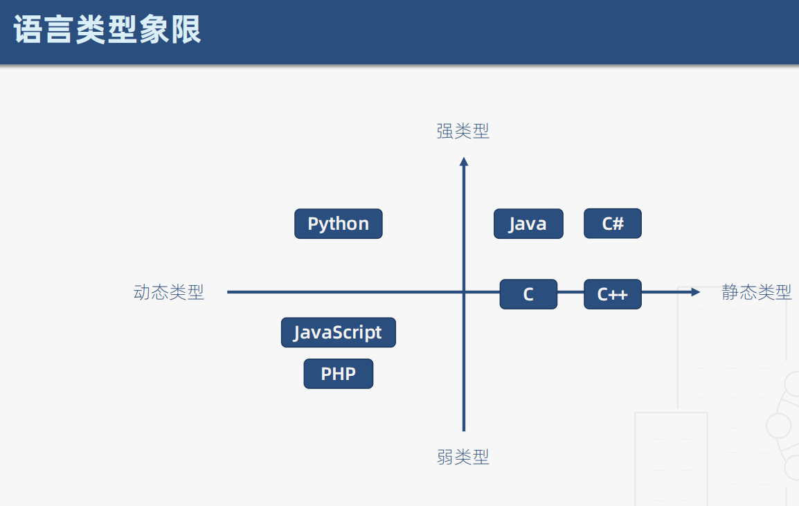

## 静态类型语言：在编译阶段确定所有变量的类型
    - 对类型极度严格
    - 立即发现错误
    - 运行时性能好
    - 自文档化

## 动态类型语言：在执行阶段确定所有变量的类型

### javascript 是一门动态弱类型语言
    对变量的类型非常宽松
    在 es 标准退出静态类型检查之前，typescript 是最佳解决方案
   
    
### TypeScript 是拥有类型系统的 javascript 的超集，可以编译成 纯 javascript
    特点：
        - 类型检查
        - 语言扩展
        - 工具属性
    优点：
        - 接口定义代替文档
        - 编辑器能够提高开发效率，降低维护成本
        - 重塑类型思维
### 类型：
        es6             typesctipt 新增
        |               |
        Boolean         void
        Number          any
        String          never
        Array          元组
        Function       枚举
        Object         高级类型
        undefined
        null
    1. 原始类型：
        let flag: boolean = false; 
        let num: number = 123;
        let str: string = 'abc'

    2. 数组
        let arr1: number[] = [1, 2, 3]; 
        let arr2: Array<number> = [1, 2, 3]; 

    3. 元组 （限定了数组元素的类型及个数）
        let tuple: [number, string] = [1, '2b']; 
        // 可以往元组中 push，但是不可以越界访问

    4. 函数
        let add = (x: number, y: number): number => (x + y)
        定义，待实现的函数类型：
            let callback: (x: number, y: number) => number

    5. 对象
        let obj: { a: number, b: string} =  { a: 1, b: '2b' }

    6. Symbol 唯一的值
        let s1: symbol = Symbol();
        let s2 = Symbol();
        s1 !== s2

    7. undefined、null 是任何类型的子类型
        tsconfig.json 中需要配置 "strictNullChecks": false, 

    8. 定义变量，不指定类型，那么默认就是 any 类型
        可以任意赋值
        非特殊情况不用 any
        使用 any 就相当于没用 ts

### 类型注解：
    (变量/函数): Type
